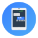

#  Changelog

All notable changes to this project will be documented in this file.

The format is based on [Keep a Changelog](https://keepachangelog.com/en/1.0.0/),
and this project adheres to [Semantic Versioning](https://semver.org/spec/v2.0.0.html).

## [1.1.0]

### Added

- MVNO (Mobile Virtual Network Operator) support with intelligent network code handling
- Reverse lookup to find numeric MCC+MNC codes from operator names
- Network code caching to handle modems that alternate between operator name and numeric code
- Improved network name resolution for empty or missing names

### Fixed

- Fixed handling of modem quirk where NetworkCode field contains operator name instead of numeric MCC+MNC
- Better handling of NITZ operator names in network information

## [1.0.1]

### Fixed

- Added network state mapping to user-friendly format (e.g., "Registered (Home)" instead of "HomeNetwork")
- Improved handling of unknown sensor values (-1, 99) by converting to None

### Added

- Comprehensive network operator database with 200+ carriers worldwide
- Network Name lookup for MCC+MNC codes including US, Canada, Europe, Asia, Latin America, and MVNOs
- Fallback to Gammu's GSMNetworks database when operator not in custom database

## [1.0.0]

### Initial Release

- Initial release
- Support for sending and receiving SMS messages via Gammu
- 8 sensor entities: Signal Strength, Signal Percent, Bit Error Rate, Network Name, State, Network Code, CID, LAC
- Home Assistant config flow UI integration
- Event firing for incoming SMS messages
- Notify service for sending SMS
- Compatibility with various GSM modems through Gammu library
